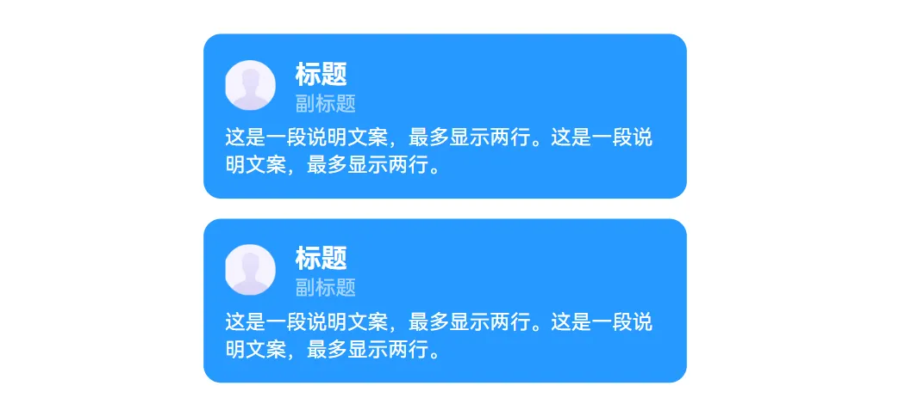

# 列表框美化

  自定义官方的列表框样式。

<h2>使用</h2>

1. 把控件拖动到屏幕中（可以隐藏掉）
2. 列表数据框控件切换为卡片样式。
3. 按 F12 查看列表框的 ID，复制到控件的 ID 输入框内即可。

<h2>使获取控件ID</h2>

首先按 F12 打开浏览器的开发者选项。
1. 点击视图检查按钮。
2. 鼠标移动到控件上，点击一下。
3. 右侧会自带定位到该控件的代码位置。（图中黄色框）
4. 找到上面带有id属性的div，后面的一段字母就是控件的 ID。（图中绿色线条）

<h2>触底加载</h2>

通过控件的事件，可以做到滑动到底部时请求数据，实现无限滚动。
1. 打开屏幕时调用 `添加滑动监听器`。
2. 添加后，列表框滑动到底部时，就会调用 `滑动到底部时` 事件，就可以在这个事件下面获取数据，然后把数据添加到列表数据后面。
3. 当你设置完数据后，记得调用 `加载完成` 积木，告诉控件我的数据已经加载完了，然后控件就会等待下一次滑动到底部。

<h2>更新说明</h2>

**版本：1.3.2**
- 增加圆角修改。

**版本：1.3.1**
- 隐藏横向时的滑动条

**版本：1.2.0**
- 增加滑动触底事件。

**版本：1.1.0**
- 修复部分主题样式不生效。

**版本：1.0.0**
- 无

<h2> 下载</h2>

请点击ZIT-CoCo-Community上方的下载按钮

---
文档作者：琦琦  
Markdown排版：小圳  
在排版时可能对内容进行了改动  