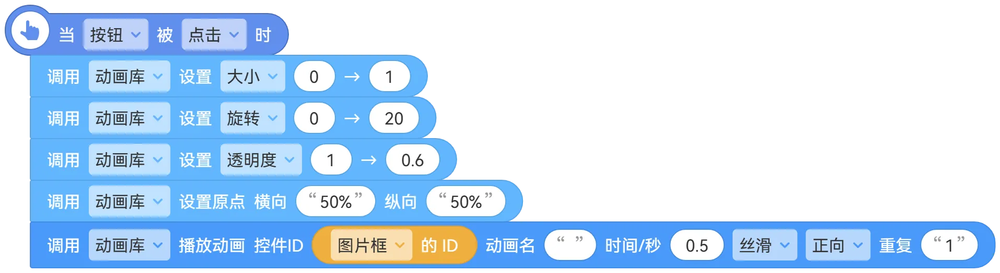
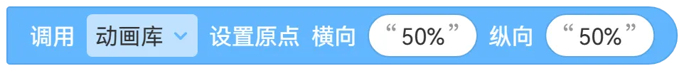
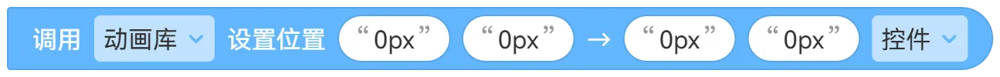

# 动画库

  给你的控件添加狂拽酷炫的动画。

<h2>快速上手</h2>

### 1.基础动画
>  点击按钮后，把图片框在`0.5`秒内把大小从`0`变成`1`。

|名称|功能|
|---|---|
|**控件ID**|放入需要播放动画的控件 ID，控件库内的可见控件都提供了快速获取 ID 的积木|
|**动画名**|动画名	填入保存的动画名称，不使用可以留空|
|**时间/秒**|设置动画的持续时间|
|**[ 丝滑 ]**|设置动画的曲线，常用的是`丝滑`，还有多种曲线可供选择|
|**[ 正向 ]**|设置动画播放的方向，例如设置大为`0 → 1`，切换为`反向`后，动画会以`1 → 0`播放|
|**重复**|设置动画重复播放的次数，填入`Infinite`可以无限播放，当然也可以输入`999999...`|

 支持同时给多个控件设置相同的动画，你可以把控件 ID 拼在一起，中间用英文逗号分开。

### 2.自由分配

>  可以自由设置需要的动画，这些动画都会同时设置给指定 ID 的控件。

### 3.进阶参数
#### 3.1动画原点

**原点：** 动画的锚点，`0%` `0%`为左上角，`50` `%50%`为中心，`100%` `100%`就是右下角。
单位可以使用百分比%也可以使用像素`px`，取决于你的动画。

#### 3.2动画位置

设置控件的位移，从`XY`移动到`XY`。
积木最后一个参数用来设置是相对于控件当前位置进行移动，还是相对于屏幕进行移动。
**控件：** `0px` `0px`表示为控件当前位置
**屏幕：** `0px` `0px`表示为屏幕左上角的位置

### 3.保存动画

如果你有很多控件需要执行相同的动画，但这些控件在不同的屏幕，如果每次播放动画都单独设置一遍，就会非常麻烦，并且还浪费积木。

动画库支持 **保存** 创建的动画，你可以在一个屏幕中创建动画，**给动画设置名称并保存**，然后就可以在播放动画时直接输入动画名来播放指定的动画，这个动画可以在 **任意屏幕** 中使用。

<h2> 下载</h2>

请点击ZIT-CoCo-Community上方的下载按钮

---
文档作者：琦琦  
Markdown排版：小圳  
在排版时可能对内容进行了改动  