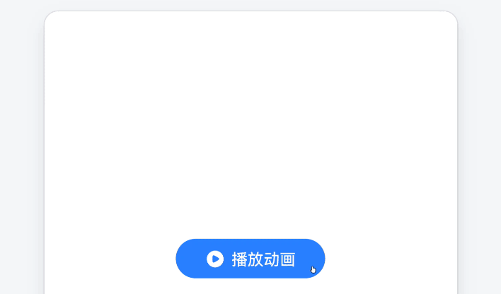

# 动画库

  给你的控件添加狂拽酷炫的动画。

<h2>快速上手</h2>

### 1.基础动画
>  点击按钮后，把图片框在`0.5`秒内把大小从`0`变成`1`。

|名称|功能|
|---|---|
|**控件ID**|放入需要播放动画的控件 ID，控件库内的可见控件都提供了快速获取 ID 的积木|
|**动画名**|动画名	填入保存的动画名称，不使用可以留空|
|**时间/秒**|设置动画的持续时间|
|**[ 丝滑 ]**|设置动画的曲线，常用的是`丝滑`，还有多种曲线可供选择|
|**[ 正向 ]**|设置动画播放的方向，例如设置大为`0 → 1`，切换为`反向`后，动画会以`1 → 0`播放|
|**重复**|设置动画重复播放的次数，填入`Infinite`可以无限播放，当然也可以输入`999999...`|

