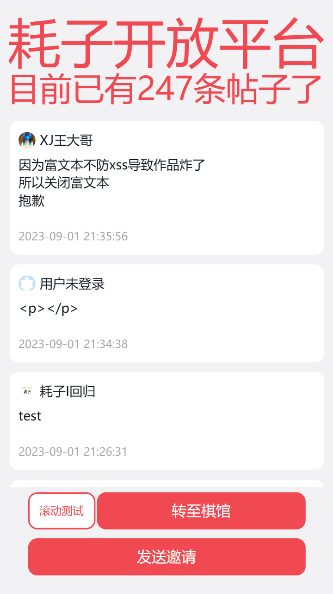
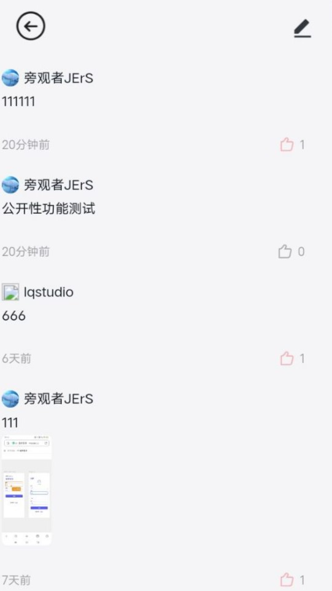
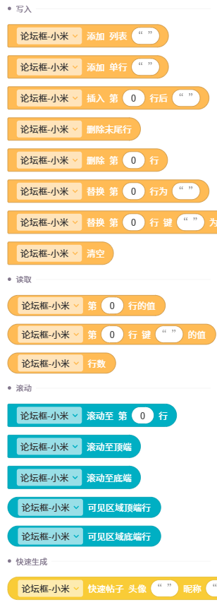
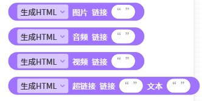

# 论坛列表框-小米 手册
## 介绍
**论坛列表框-小米**是一款CoCo编辑器的可见控件，可以快速构建一个精美的论坛样式列表框，样式类似小米论坛。​
您可在CoCoQ群中获取，目前最新版为`先行版`。

### 😍 我们的特色： 
🌺 全面碾压列表框，专为论坛设计​  
🌻 精美卡片样式，清爽美观​  
🌸 直接读写数据，高效便捷​  
🌹 积木操作滚动，更多玩法​  
🍂 有点赞评论位，方便互动​  
🍁 可解析HTML，无限创意​  
🍀 自定头衔颜色，多彩标识​  
🌾 可放多张图片，缤纷呈现​  
🌵 不断更新优化，未来更好  

## 示例作品
- [耗子开放平台](https://coco.codemao.cn/editor/player/197045295?channel=h5)
  
- [DUCKDUCK](https://coco.codemao.cn/editor/player/194854405?channel=h5)
  
- [鸭信](https://coco.codemao.cn/editor/player/157678572?channel=h5)
  
>小圳提醒您，以上链接可能无法正常访问。

## 积木总览

## 使用教程
### 快速入门
使用`添加单行`+`快速生成`积木，即可创建一行信息。例如：

这步应该能让您大致了解数据读写积木的使用。​  
​
提示：有些控件没有配置快速生成类积木，您可以将`快速生成积木`替换为`字典`积木来使用。

### 使用教程
#### 数据属性
数据属性是一个每项都是字典的列表
（`[{text:'Hello'...},{},{}...]`），控件根据其来进行渲染。
注：后文将数据属性的列表项简称为数据项
#### 数据项
数据项是字典格式，`快速生成`类积木和`字典`积木都会返回一个字典，您可以使用它们向控件新增数据（见快速入门篇）。​
数据项参数指的是这个字典里应该填什么、怎么填。​
每个控件的数据项参数都不同，您需要浏览控件文档来获取控件需要的参数。例如：​[聊天框-轻蓝 手册](https://xjwangdage.feishu.cn/wiki/QplbwVF8QiRt1ZkhGNHcNJqKn9d?from=from_parent_docx#doxcnnOCxeonisLWybCsTScmJdc) 的参数章节。

#### 读写数据`积木`
对数据进行快捷读写，渲染结果会跟随数据的变动，实时更新。

#### 滚动`积木`
滚动和获取当前滚动数据。

#### 快速生成`积木`
根据提示填入信息，快速生成一个对于控件来说正确的数据项。例如：

有些控件可能没配置此类积木，您就只能用字典来。​
常见用法为放入`添加单行`积木中，快速添加一行信息。

#### 错误检查
本类控件的问题大多是：控件白屏，渲染不出来​
原因大多是：数据项错误​
所以请对照文档，检查您的某个数据项是否出现以下问题：
- 必填项没填
- 属性单词拼错
- 值类型错误，如：列表类型写成字符串；选项类型写成错误的选项

即使是一个数据项出现了很小的错误，也可能导致整个白屏！请照着文档仔细检查！
如果您想在群里问问其他人，请提供尽量多的有用信息，别说废话！例如：
- 多调试调试你的积木，可能删掉一个你刚添加的积木，BUG就没了
- 提供出错控件的屏幕截图以及你编写的相关积木
- 要是能发现是具体点的哪一块积木造成的BUG，向群友说明，那就更好了，越详细越好！
- 打印一下数据，把输出结果截图发出去（尽量让数据少一些，会让别人更好查找出错的地方）
- 用后文提到的出错事件查看报错信息，或F12控制台里找找报错，发出去（右图就是出错事件提供的报错信息，意为某个数据项缺少"头像"属性）

提示：您可以换用快速生成类积木来新增数据。
渲染错误一般会报错在F12控制台，您可以查看并自行诊断，​
有的控件也提供了渲染错误事件，可以帮助您更快速的检查错误。例如：

如果还是不行，可能是控件出了BUG，可以联系控件作者。

## 小技巧
插入图片/视频/音频/超链接等​
如果控件支持富文本(解析HTML)，就可以通过HTML元素来展示图片/视频/音频/超链接等。​
将类型改为富文本，在文本中插入以下内容即可使用：​  
图片：``​  
视频：`<video controls src="视频链接"></video>`​  
音频：`<audio controls src="音频链接"></audio>`​  
超链接：`<a href="链接">显示文本</a>​`  
​
还有很多有趣的HTML元素，​
如`<b>`粗体文本、`<i>`斜体文本、`<del>`删除线文本等等，​
可以在[菜鸟教程](https://www.runoob.com/html/html-formatting.html)中学习使用。

提示：快速生成HTML元素控件可以快速生成这些元素，​
可在[点鸭控件商城](https://shequ.pickduck.cn/?mod=cocojs)中下载。

更多需查看​[轻蓝超级框架·通用教程](https://xjwangdage.feishu.cn/wiki/Gv0DwwvELigYO0kac6KcgsPEnEf)来学习使用。

## 特有属性
>空时显示骨架屏
开启后，无数据时会显示骨架屏，也就是加载动画。​
如造成编辑器卡顿，可以默认隐藏控件，并添加积木：在打开屏幕时显示。
>调试器
注：有些版本中可能没有此选项。​
此选项为了方便调试。​
开启后，在F12控制台输入`'this.d' + 控件ID`会返回控件内的this数据，可以在其中查看控件属性、调用控件内置方法等。

## 数据参数
|属性|说明|类型|默认值|
|---|---|---|---|
|头像||string||
|昵称||string||
|头衔||string||
|头衔色||`color`   `default`   `primary`   `success`   `warning`   `danger` |`default`|
|头衔填充|| `'solid'填充`   `'outline'边框` |`solid`|
|类型|文本类型|`'纯/富'​`|'纯'​|
|文本||`string`|
|图片|图片列表|`array`||
|时间||string||
|点赞||string||
|评论||string||
|点赞色||color|`#0E151C`|
|评论色||color|`#0E151C`|

## 开源协议
[https://gitee.com/xjwangdage/coco-control/blob/master/LICENSE](https://gitee.com/xjwangdage/coco-control/blob/master/LICENSE)

<h2> 下载</h2>

请点击ZIT-CoCo-Community上方的下载按钮

---
文档作者：XJ王大哥  
Markdown排版：小圳  
在排版时可能对内容进行了改动
原文链接：[https://xjwangdage.feishu.cn/wiki/GH69w1MSLiVCetkBZQNcJypxnmg](https://xjwangdage.feishu.cn/wiki/GH69w1MSLiVCetkBZQNcJypxnmg)