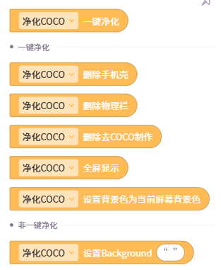
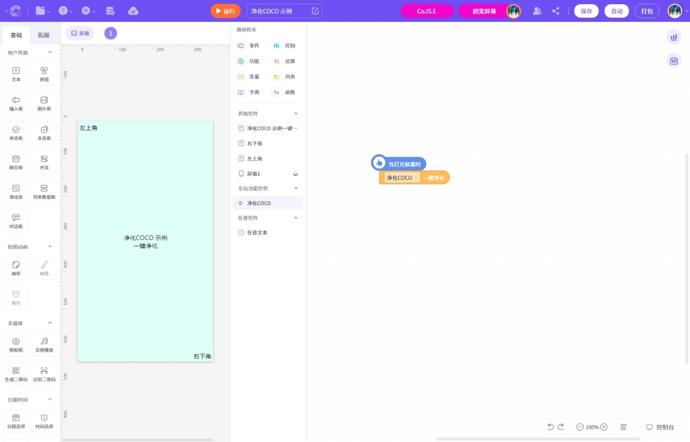
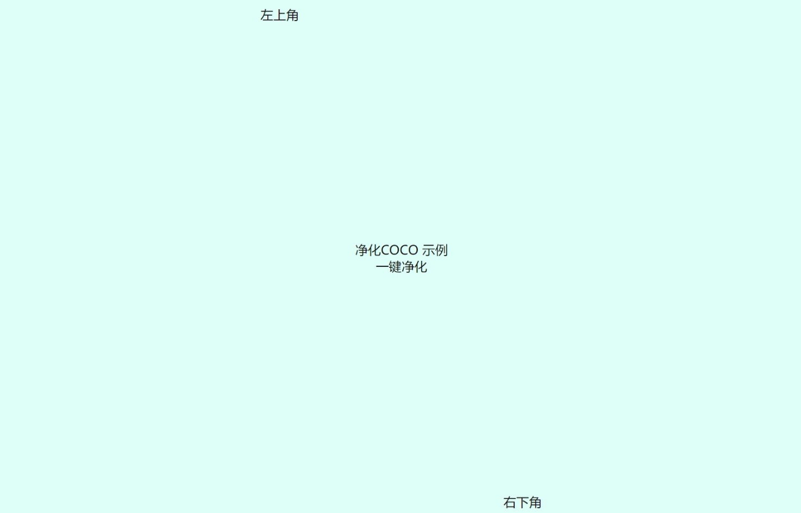

# 【一键净化】净化COCO，作品一键变网页！可一键去手机壳、全屏放大、改背景色...
还在为网页上全是COCO的标识而头疼？
这款控件
一键净化COCO，变为沉浸式网页！
本控件受Appcraft界面美化(作者:冷鱼闲风)控件启发
着重对净化方面进行了改善
## 功能

## 编辑器效果图

## H5效果图

## 协作示例：
[https://coco.codemao.cn/editor/?workId=195654573&inviteCode=Y9RV8](https://coco.codemao.cn/editor/?workId=195654573&inviteCode=Y9RV8)
>小圳提醒您，此链接似乎已失效

快来给你的作品换上吧~

## 开源协议
[https://gitee.com/xjwangdage/coco-control/blob/master/LICENSE](https://gitee.com/xjwangdage/coco-control/blob/master/LICENSE)

<h2> 下载</h2>

请点击ZIT-CoCo-Community上方的下载按钮

---
文档作者：XJ王大哥  
Markdown排版：小圳  
在排版时可能对内容进行了改动  
原文链接[https://shequ.codemao.cn/community/5585070732232448](https://shequ.codemao.cn/community/5585070732232448)