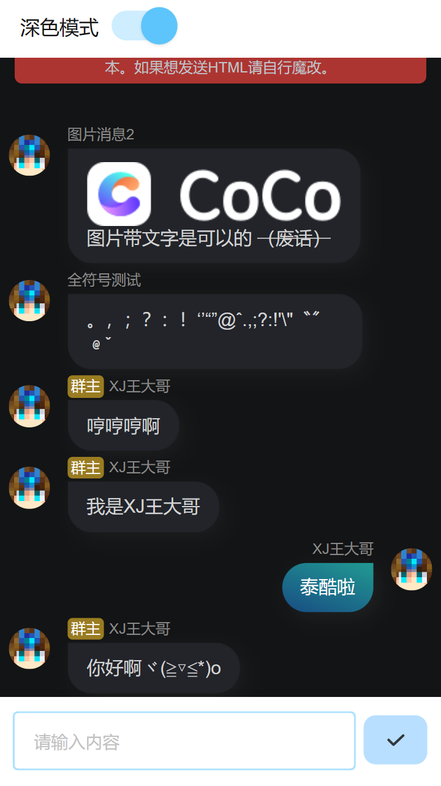
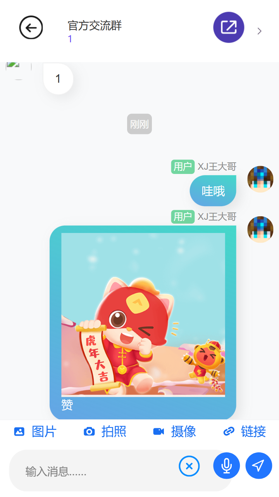
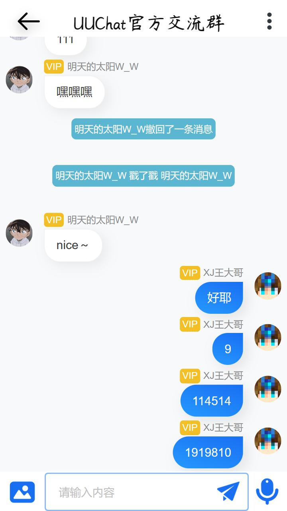
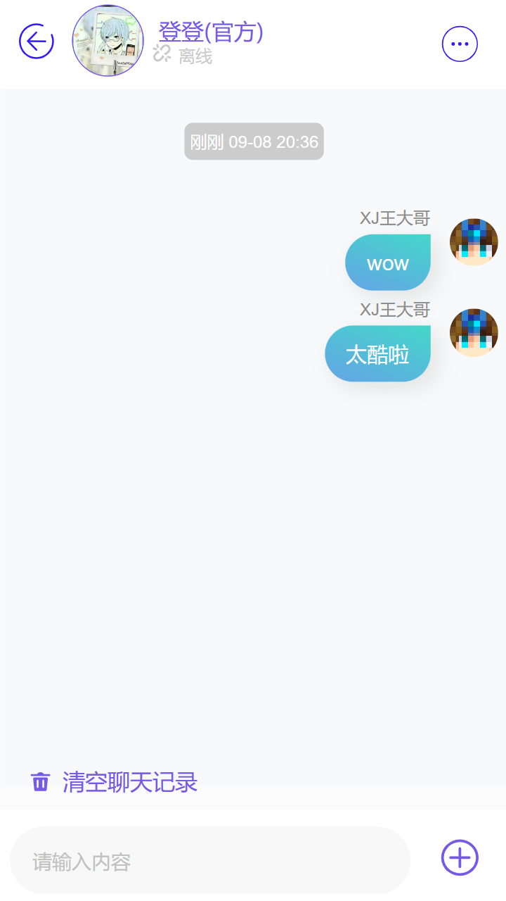

# 聊天框-轻蓝 手册
## 介绍​
聊天框-轻蓝是一款CoCo编辑器的可见控件，可轻松创建一个精美的气泡框样式聊天框，每条消息包括头像、昵称、消息内容等元素。​
您可至[云盘下载](https://www.123pan.com/s/XjH9-UDhxd.html)本控件，CoCo-Community或在CoCoQ群中获取，目前最新版为1.0.0。
## 示例作品
### [聊天框-轻蓝_示例](https://coco.codemao.cn/editor/player/194408564?channel=h5)
>小圳提醒您，此超链接可能无法访问

### [鸭信](https://coco.codemao.cn/editor/player/157678572?channel=h5)
>小圳提醒您，此超链接可能无法访问

### [UUChat](https://coco.codemao.cn/editor/player/174216482?channel=h5)
>小圳提醒您，此超链接可能无法访问

### [趣聊](https://coco.codemao.cn/editor/player/190307027?channel=h5)
>小圳提醒您，此超链接可能无法访问

## 使用教程
您需要查看​[轻蓝超级框架·通用教程](https://xjwangdage.feishu.cn/wiki/Gv0DwwvELigYO0kac6KcgsPEnEf?from=from_parent_docx)来学习使用。

## 参数
|属性|说明|类型|默认值|
|---|---|---|---|
|messageType*|类型|'text'纯文本气泡​  'raw'富文本气泡​ 'tipsNormal'灰色提示  'tipsPrimary'蓝色提示​  'tipsSuccess'绿色提示​  'tipsInfo'青色提示​  'tipsWarning'橙色提示  'tipsDanger'红色提示||
|html*|文本| `string `||
|headIcon*|头像| `string` ||
|name*|昵称|`string`||
|position*|消息显示位置|'left'左​  'right'右 ||
|diamond|是否方形头像|`boolean`|`false`|
|htitle|头衔|`string`||
|htitleType|头衔类型|空为灰色​   'admin'蓝色  'owner'金色|`(灰色)​`|
|message|备注信息|`any`||
|colorUp|气泡背景渐变色上|`color`|`#44d7c9`|
|colorDown|气泡背景渐变色下|`color`|`'rgba(63, 143, 225, .8)'`​|
|color|气泡文本颜色|`color`|'#fff'|
注：带`*`为必填项，colorUp、colorDown和color同时使用时才会生效。
## 其他​
本控件渲染部分使用Github开源的[LiteWebChat_Frame(轻网页聊天框架)](https://github.com/MorFansLab/LiteWebChat_Frame)制作，​
在此感谢作者。

## 开源协议
[https://gitee.com/xjwangdage/coco-control/blob/master/LICENSE](https://gitee.com/xjwangdage/coco-control/blob/master/LICENSE)

<h2> 下载</h2>

请点击ZIT-CoCo-Community上方的下载按钮

---
文档作者：XJ王大哥  
Markdown排版：小圳  
在排版时可能对内容进行了改动
原文链接：[https://xjwangdage.feishu.cn/wiki/QplbwVF8QiRt1ZkhGNHcNJqKn9d](https://xjwangdage.feishu.cn/wiki/QplbwVF8QiRt1ZkhGNHcNJqKn9d)